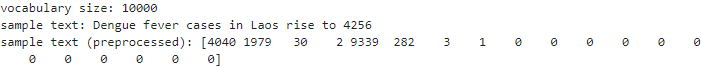

## The Machine Learning Project Lifecycle
 
 

## Case study
 
 
A news-related application wants to classify news articles collected from several sources

## Scoping

In this project, I'll use an existing prototype to identify ways to improve the system's performance iteratively, establishing a baseline or ensuring a balanced train/dev/test split and performing error analysis to prioritize what to work on. 
I'll also track experiments(with experiment-tracker.csv), including metrics so I can monitor  progress in improving the model. 
Finally, I'll deploy the model using Tensorflow Serving. 

In **data-centric AI development**, the quality of the data is is vital. I will hold the model code fixed and iteratively improving the data to achieve better model performance.
To convert the string titles to numeric features, I'll need to tokenize them and generate integer sequences for each title. This can be done with a [TextVectorization()](https://www.tensorflow.org/api_docs/python/tf/keras/layers/TextVectorization) layer that uses the `vocabulary.txt` file in `vocab_d`. 

 
 

## Utility functions
 
 
Utility functions that I used: 

* df_to_tfdata - Converts a pandas dataframe to a tf.data.Dataset

* model_reset_weights - Resets the model with random weights

* get_errors - Prints error predictions for a given a news topic

save_data

save_vocab

save_labels

set_experiment_dirs

* print_metric_per_topic - Prints the accuracy per class of news topics

I get the evaluation metrics by running the code below.
## Convert the test dataframe to a tf dataset
test_ds = lab_utils.df_to_tfdata(test_df, topic_lookup, title_preprocessor)
## Get the metrics
model.evaluate(test_ds)
763/763 [==============================] - 1s 990us/step - loss: 1.0202 - sparse_categorical_accuracy: 0.7778
[1.0201756954193115, 0.7778187394142151]
 
 
SparseCategoricalAccuracy() measures how often the predictions match integer labels. As shown above, the current model has 78% accuracy across all rows in the test dataset. 

#### Create a balanced train/dev/test split

I looked at is the data splits.
The percentage of each class is not the same between the train and test sets.
Because of this imbalance, the learning algorithm might not find a lot of patterns for the science-related titles and will likely underperform compared to the rest of the topics.
One strategy is a better balance between the topics is to recombine the train and test sets into one pool, then split them again in a more balanced way.

## Modeling
 
 
In the Modeling stage, I selected a model to learn from the data. I will evaluate its performance and perform error analysis to know how it can be improved. 

## Select and train the model
 
 

For data-centric AI development, I do a quick analysis of the prototype model with the improved dataset before making changes to the model. I use the same model architecture and feed in the datasets I generated above. 

## Adding data
 
 
There are some techniques for augmenting text data (such as synonym replacement, random insertion, random swap, and random deletion).

## Modify the Model Parameters
 
 
Modifying the model parameters to observe the effects on model performance.
Adding more layers or just modifying the dimensionality of the embedding and dense layers.
I used the experiment-tracker.csv  that tracks important metrics and points to relevant directories.

## Deploy in Production
 
 

### Deployment Patterns

Having a way to serve different versions of the model can be useful for easy roll back (blue green deployment) or to gradually switch to a newer version (canary deployment). For TF Serving, this is done through a `model_config_file`. Model_config file and the models are present in the folder SERVING

### Monitor and Maintain System

Deploying an ML system is not the end of a project. Over time, its performance will degrade as gradual change or sudden shock makes the incoming data less like those that the model was trained on. One problem is concept drift where the relationship between the inputs and outputs change.  Another is data drift where the input distribution changes.

Metrics and Alarms
When your model goes live in production, you will want to know as early as possible if there's a problem. 

* **Software metrics - These refer to the capacity of the platform to deliver your prediction service. It includes measuring available memory and compute resources, latency, throughput, and server load. 

* **Input metrics - These refer to the characteristics of the incoming data. You can use these to detect if your input distribution is changing or if there are edge cases that you might have not considered.

* **Output metrics - These refer to the results of the model predictions.

  

